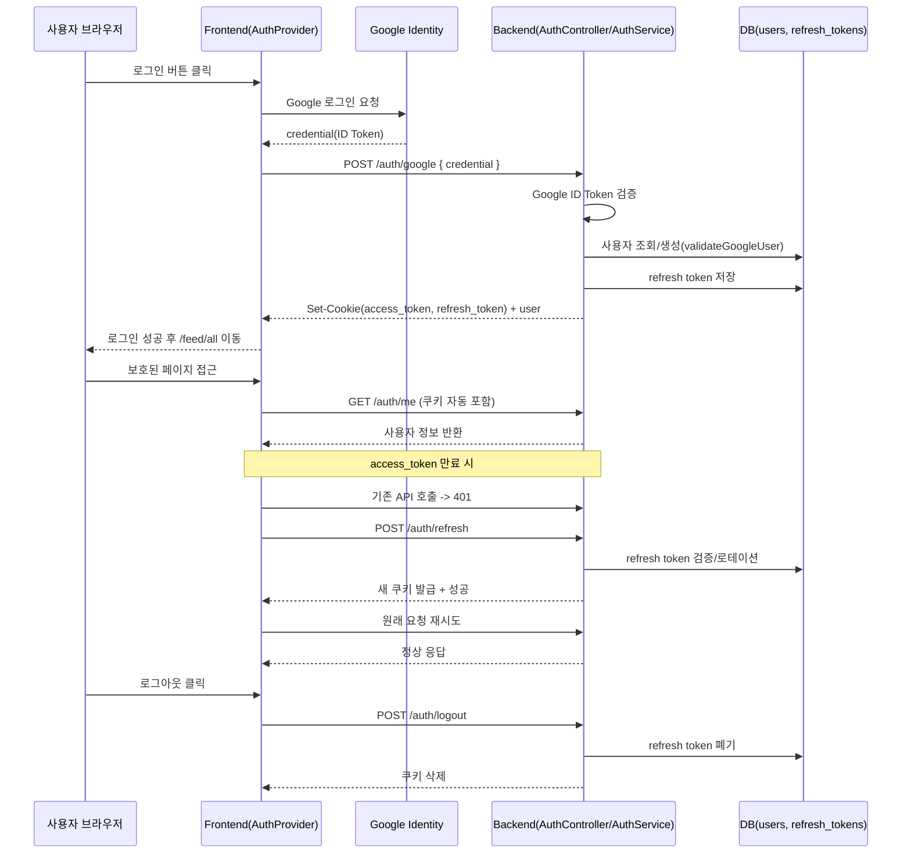

# 로그인 과정 문서

이 문서는 **일반 사용자 앱(`frontend` + `backend`) 기준 로그인/세션 유지/로그아웃 흐름**을 설명합니다.

## 1) 로그인 흐름 요약

Stashy의 일반 사용자 로그인은 Google Identity Services에서 발급한 `credential(ID Token)`을 백엔드로 전달해 검증한 뒤,
백엔드가 `access_token` + `refresh_token` 쿠키를 발급하는 구조입니다.

- 로그인 API: `POST /auth/google`
- 세션 확인 API: `GET /auth/me`
- 토큰 재발급 API: `POST /auth/refresh`
- 로그아웃 API: `POST /auth/logout`

---

## 2) 전체 순서도 (Mermaid)

---

## 3) 상세 단계

### A. 초기 로그인 (`POST /auth/google`)

1. 프론트의 `GoogleLoginButton`이 Google SDK를 초기화하고, 로그인 성공 콜백으로 `handleGoogleLogin`을 호출합니다.
2. `handleGoogleLogin`은 `authApi.loginWithGoogle(credential)`로 `/auth/google`을 호출합니다.
3. 백엔드 `AuthController.googleLogin`은 `AuthService.verifyGoogleToken`으로 Google ID Token을 검증합니다.
4. `AuthService.validateGoogleUser`가 `googleId` 기준으로 사용자를 찾고,
   - 기존 사용자면 그대로 사용
   - 없으면 닉네임 생성 후 신규 가입 처리
5. 정지된 계정(`suspendedAt`)이면 로그인 차단합니다.
6. `generateTokenPair`로 Access/Refresh 토큰을 생성하고 쿠키(`httpOnly`)로 내려줍니다.
7. 연속 로그인(streak) 집계를 수행하고 사용자 정보를 응답합니다.
8. 프론트는 사용자 상태를 저장하고 `/feed/all`로 이동합니다.

### B. 앱 진입 시 인증 상태 복원 (`GET /auth/me`)

1. `AuthProvider` 마운트 시 `fetchUser()`가 실행됩니다.
2. `authApi.getMe()`가 `/auth/me`를 호출합니다.
3. 브라우저가 `access_token` 쿠키를 자동 전송하고, 백엔드 `AuthGuard("jwt")`가 인증 처리합니다.
4. 성공하면 사용자 컨텍스트가 채워지고, 실패하면 `user=null`로 유지됩니다.

### C. Access Token 만료 시 자동 재발급 (`POST /auth/refresh`)

1. 프론트 API 클라이언트가 일반 API 요청에서 `401`을 받으면 `/auth/refresh`를 호출합니다.
2. 백엔드는 `refresh_token` 쿠키를 검사하고 유효하면 새 Access Token 발급 + Refresh Token 로테이션을 수행합니다.
3. 프론트는 원래 요청을 1회 재시도합니다.
4. 재발급도 실패하면 세션 만료로 판단하고 `/`로 이동시킵니다.

### D. 로그아웃 (`POST /auth/logout`)

1. 프론트 `logout()`이 `/auth/logout` 호출
2. 백엔드는 전달된 `refresh_token`을 저장소에서 폐기
3. `access_token`, `refresh_token` 쿠키를 모두 clear
4. 프론트는 로컬 사용자 상태를 제거하고 메인 페이지(`/`)로 이동

---

## 4) 보안/동작 포인트

- 토큰은 JS에서 직접 읽을 수 없도록 `httpOnly` 쿠키로 관리합니다.
- CORS는 `credentials: true`로 설정되어 쿠키 기반 인증이 가능해야 합니다.
- 쿠키 옵션은 환경에 따라 달라집니다.
  - 개발: `secure=false`, `sameSite=lax`
  - 운영: `secure=true`, `sameSite=none`
- 보호 라우트는 `AuthLayout`에서 `isAuthenticated`와 `isLoading` 상태를 기준으로 접근 제어합니다.

---

## 5) 관련 코드 위치

- 프론트 로그인 버튼: `frontend/src/components/auth/GoogleLoginButton.tsx`
- 프론트 인증 상태 관리: `frontend/src/contexts/AuthProvider.tsx`
- 프론트 API 인증 로직(401 -> refresh): `frontend/src/lib/api/api.ts`
- 백엔드 인증 엔드포인트: `backend/src/auth/auth.controller.ts`
- 백엔드 인증 핵심 서비스: `backend/src/auth/auth.service.ts`
- JWT 쿠키 추출/검증: `backend/src/auth/strategies/jwt.strategy.ts`
